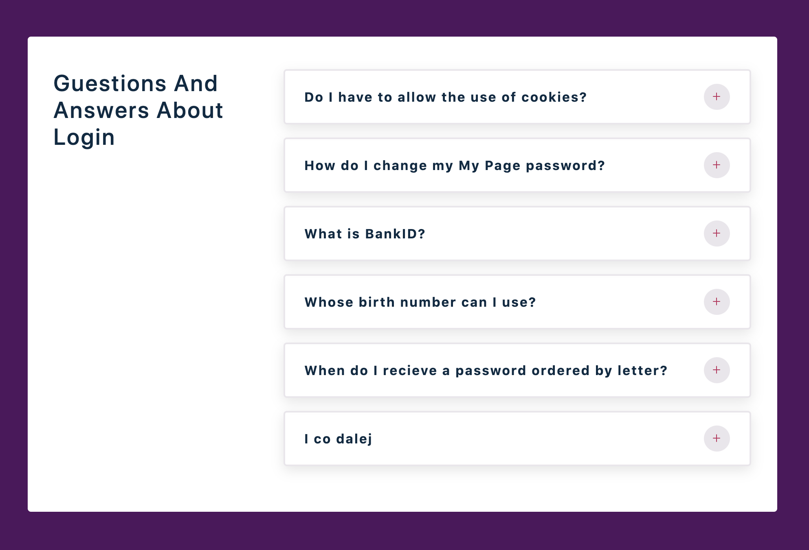

## React project accordion

#### Idea

[uidesigndaily](https://uidesigndaily.com/posts/sketch-accordion-website-day-1175)


#### React Icons

[react icons](https://react-icons.github.io/react-icons/)

```
npm install react-icons --save
```

```javascript
import { FaHome } from 'react-icons/fa';
const Component = () => {
  return <FaHome className='icon'></FaHome>;
};
```

